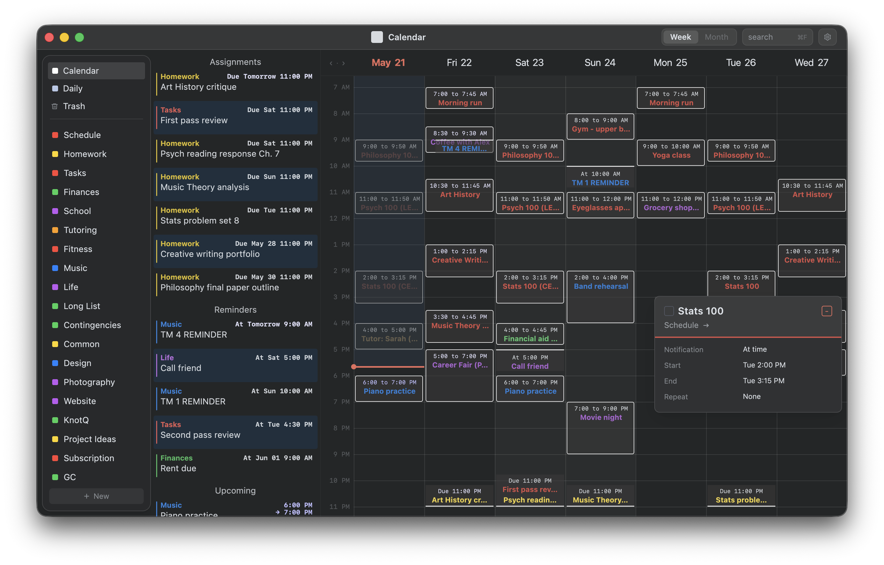
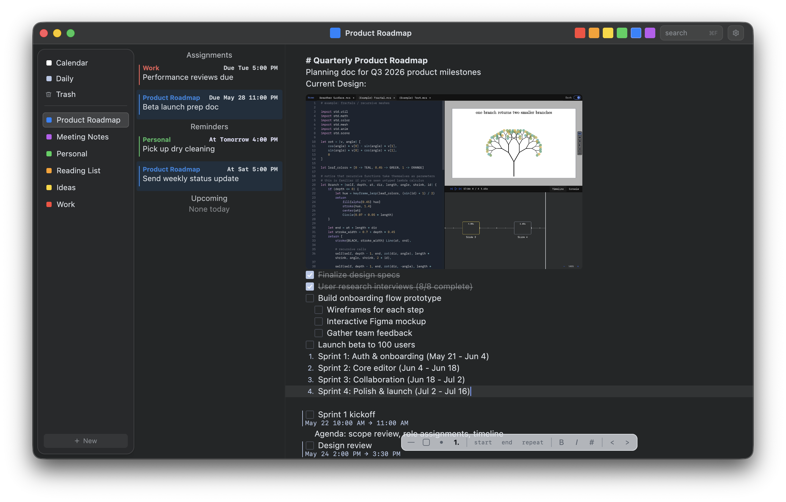
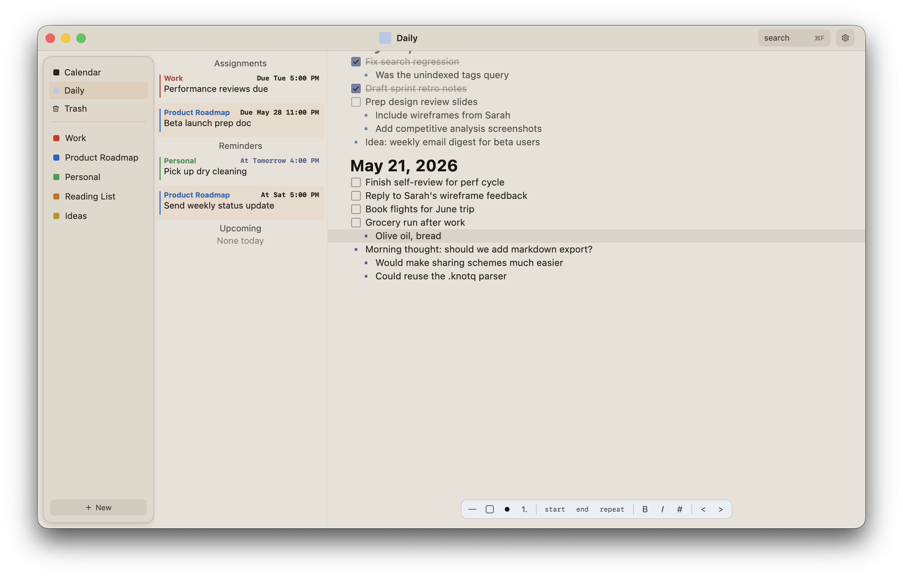

# KnotQ

KnotQ is a local-first desktop productivity app that brings structured notes and a calendar into one workspace. Write plans in documents, schedule from any line, and keep your tasks, reminders, assignments, and events connected without a cloud account.

<p align="center">
  
</p>

## Notes That Become a Calendar

KnotQ documents are called schemes. Each line can be plain text, a checkbox, a bullet, a numbered item, or a scheduled calendar object. Add a start time, end time, or both, and KnotQ turns that line into a reminder, assignment, or event.

<p align="center">
  
</p>

## Daily Queue

The Daily Queue gives every day a dedicated planning page for quick tasks, notes, and carry-over work. It is built for the small, concrete list you actually work from during the day.

<p align="center">
  
</p>

## Local First

KnotQ stores schemes, folders, tasks, calendar entries, and settings locally on your device. Optional Google Calendar import is read-only, so external events can appear alongside your workspace without KnotQ modifying your Google account.

## Download

Download the latest desktop release:

https://github.com/knotq-app/knotq-app/releases

Linux users can install from the release tarball with:

```sh
curl -fsSL https://knotq.com/install.sh | sh
```
